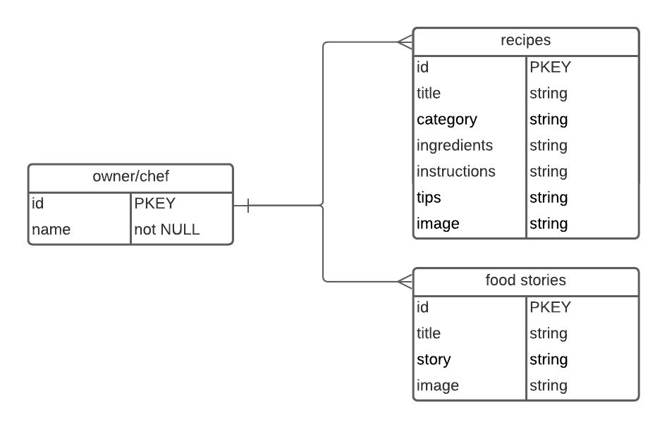
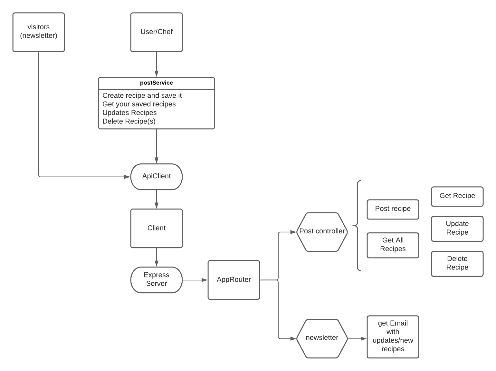
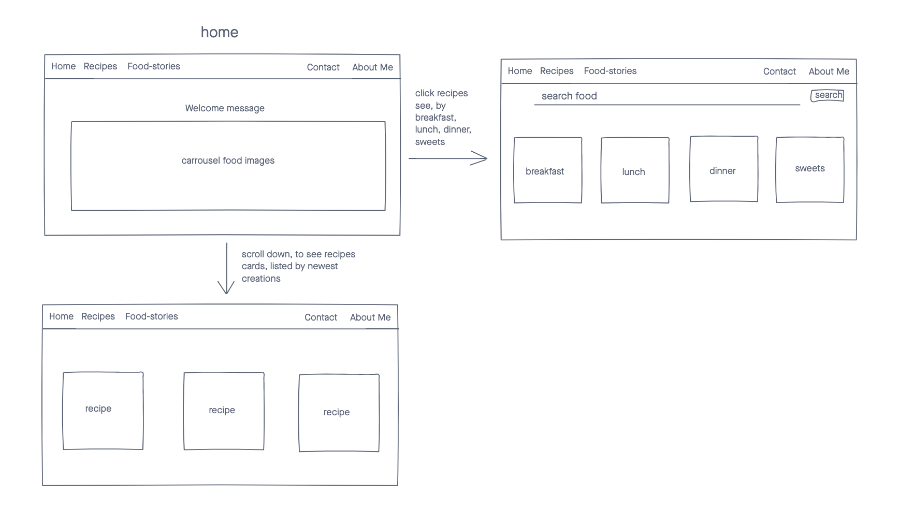

# The Dutch Chef

Date: January 10, 2020

By: Lisa Venneker Wand

[GitHub](https://github.com/LisaKVW/the-Dutch-Chef) |
[LinkedIn](https://www.linkedin.com/in/lisa-venneker-wand-8413ab25/) 

## Description
Site to find delicious recipes and restaurant stories through the eyes of the Dutch Chef.

## Technologies used

## How to get started
Visit the site and view recipes and food stories. Like what you read? Signup to receive updates on new recipes and stories.

## User Stories
1. Users can visit the site and read and try out the Dutch Chef's recipe's.
2. Read about restaurant reviews/stories that the Dutch Chef tried.
3. Sign-up for the newsletter, and receive emails with updates on new recipes, stories or share a recipe that the Dutch Chef can try and post.

## ERD

## Flow Chart

## Wireframe

## Screenshots
Screenshots of site:
Landing Page

Categories recipes

Food Stories

Contact page

## Credits
- https://www.lucidchart.com/pages
- https://icons8.com/
- https://www.invisionapp.com/freehand 
- https://mailchimp.com/ API 
- https://imgur.com 
- https://materializecss.com/ 

## Future updates
- Video's of cooking/how to make the recipes
- More stories and recipes!
